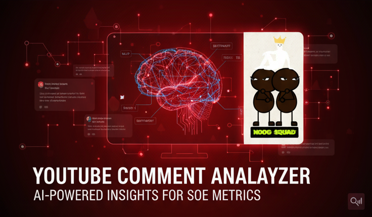
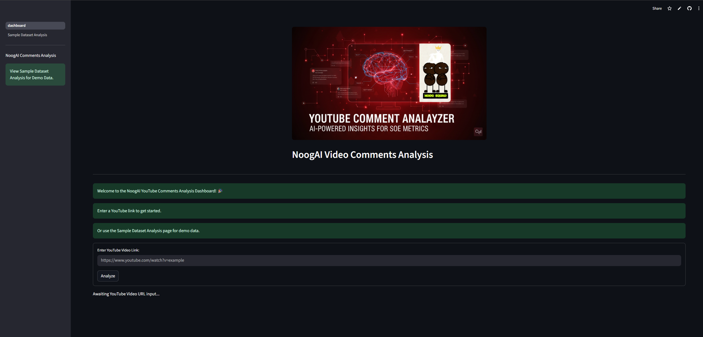
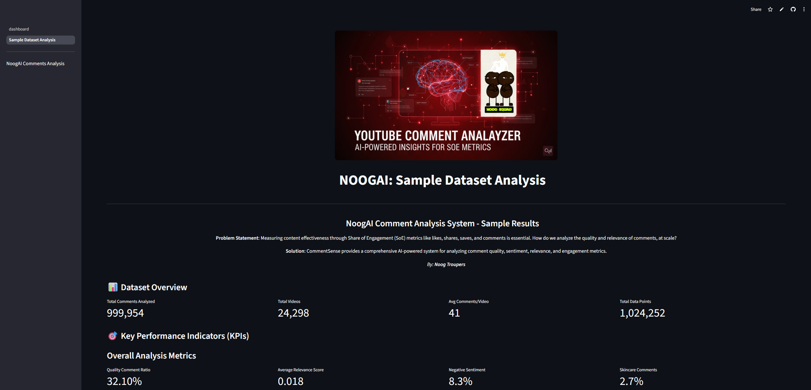

# 🚀 NoogAI: AI-Powered YouTube Comment Analysis System

**Comprehensive comment analysis platform for beauty content creators and marketers**



The dashboard can be viewed here: https://noogai.streamlit.app/

## 📋 Table of Contents
- [Overview](#🎯-overview)
- [Features](#✨-features)
- [Architecture](#🏗️-architecture)
- [Quick Start](#🏃-quick-start)
- [Dashboard Usage](#📈-dashboard-usage)
- [Sample Dataset Analysis](#🔬-sample-dataset-analysis)
- [API Reference](#api-reference)
- [Development](#development)
- [Deployment](#🚀-deployment)
- [Contributing](#contributing)

## 🎯 Overview

NoogAI is an advanced AI-powered system designed to analyze YouTube video comments at scale, providing actionable insights for beauty content creators, brand managers, and social media strategists. The platform specializes in beauty-related content analysis with sophisticated natural language processing capabilities.

### Problem Statement
Measuring content effectiveness through Share of Engagement (SoE) metrics like likes, shares, saves, and comments is essential. How do we analyze the quality and relevance of comments at scale?

### Solution
NoogAI provides comprehensive AI-powered analysis including:
- **Quality Assessment**: Multi-factor quality scoring
- **Sentiment Analysis**: RoBERTa-based transformer model
- **Spam Detection**: Advanced pattern recognition
- **Category Classification**: Beauty-specific categorization (skincare, makeup, fragrance)
- **Relevance Scoring**: TF-IDF cosine similarity analysis
- **Interactive Dashboards**: Real-time visualization and insights

By: **Noog Troupers**

## ✨ Features


### 🔍 Core Analysis Capabilities
- **Advanced Text Preprocessing**: Cleaning, tokenization, stemming with beauty-specific vocabulary
- **Sentiment Analysis**: State-of-the-art transformer models (cardiffnlp/twitter-roberta-base-sentiment-latest)
- **Quality Assessment**: Multi-dimensional quality scoring based on length, relevance, sentiment, and engagement
- **Spam Detection**: Machine learning-based spam identification with beauty industry context
- **Beauty Category Classification**: Specialized classification for skincare, makeup, fragrance, and general content
- **Relevance Analysis**: TF-IDF vectorization with cosine similarity scoring


### 📊 Interactive Dashboard
- **Video-by-video Analysis**: Analyse comments from a Youtube link
- **Visual Analytics**: Interactive charts and graphs using Plotly
- **KPI Tracking**: Comprehensive metrics dashboard
- **Export Functionality**: CSV download for further analysis
- **Sample Dataset Demo**: Pre-computed analysis results showcase

### 🎬 Video-Specific Features
- **Per-Video Analytics**: Detailed breakdown for individual videos
- **Comment Volume Analysis**: Engagement metrics and trends
- **High-Quality Comment Extraction**: Showcase of valuable feedback
- **Category-Specific Insights**: Beauty niche-specific recommendations

### 🔧 Technical Features
- **Scalable Processing**: Batch processing with progress tracking
- **Caching**: Optimized performance with Streamlit caching
- **Error Handling**: Robust error management and user feedback
- **Multi-page Application**: Organized dashboard structure
- **Responsive Design**: Mobile-friendly interface

## 🏗️ Architecture

```
NoogAI/
├── model/                      # Core AI Models
│   ├── __init__.py            # Package initialization
│   ├── preprocessor.py        # Text preprocessing and cleaning
│   ├── sentiment_analysis.py  # Sentiment analysis pipeline
│   ├── relevance_analysis.py  # Relevance scoring system
│   ├── analytics.py           # KPI calculation and insights
│   ├── visualization.py       # Chart creation and dashboards
│   ├── video_analysis.py      # Video-specific analytics
│   └── dataset.py            # Data loading and management
├── dashboard/                  # Streamlit Web Application
│   ├── dashboard.py           # Main analysis dashboard
│   ├── helper.py             # YouTube API utilities
│   └── pages/
│       └── Sample_Dataset_Analysis.py  # Pre-computed demo
├── assets/                    # Static resources
│   ├── header.png            # Banner image
│   └── logo.jpeg             # NoogAI logo
├── main.py                   # CLI analysis pipeline
├── examples.py               # Usage examples
├── requirements.txt          # Python dependencies
├── .env                     # Environment variables
└── README.md                # Documentation
```

### Data Flow
1. **Input**: YouTube URL or pre-computed CSV data
2. **Processing**: Multi-stage AI pipeline (preprocessing → sentiment → relevance → quality)
3. **Analysis**: KPI calculation and insight generation
4. **Visualization**: Interactive dashboard creation
5. **Export**: Results download and sharing

## 🏃 Quick Start

### Prerequisites
- Python 3.8+
- YouTube Data API v3 Key
- Required Python packages (see requirements.txt)

### Installation

1. **Clone the repository**
```bash
git clone https://github.com/lukecywon/videoanalysismodel.git
cd videoanalysismodel
```

2. **Install dependencies**
```bash
pip install -r requirements.txt
```

3. **Set up environment variables**
Edit the `.env` file in the root directory: (only needed for dashboard)
```env
YOUTUBE_API_KEY="your_youtube_api_key_here"
```

### Running the Application

#### Option 1: Streamlit Dashboard (Recommended)
```bash
streamlit run dashboard/dashboard.py
```

#### Option 2: Command Line Interface
```bash
python main.py
```

#### Option 3: Interactive Examples
```bash
python examples.py
```

#### Option 4: Jupyter Notebook
Open `sample_analysis_model.ipynb` with Jupyter Notebook, Google Colab or VSCode.
This option is for developers who wish to see exactly how the model runs.

## 📈 Dashboard Usage

### Main Dashboard (`dashboard/dashboard.py`)

#### 1. **Video Analysis**
- Enter any YouTube video URL
- Automatic video metadata extraction
- Real-time comment fetching (up to 1000 comments)
- Progress tracking with status updates

#### 2. **Analysis Pipeline**
The system processes comments through:
- **Text Preprocessing**: Cleaning and spam detection
- **Sentiment Analysis**: Emotion classification
- **Relevance Scoring**: Content alignment measurement
- **Quality Assessment**: Multi-factor evaluation

#### 3. **Results Dashboard**
- **KPI Metrics**: Quality ratio, spam rate, sentiment distribution
- **Interactive Charts**: Quality, sentiment, category, and spam visualizations
- **Relevance Distribution**: Histogram with mean indicator
- **Sample Comments**: High-quality comment showcase
- **Export Options**: CSV download functionality

#### 4. **Advanced Features**
- **Filtering**: By sentiment, category, and quality
- **Category Analysis**: Beauty-specific breakdown
- **Processing Statistics**: Performance metrics
- **Comprehensive Summary**: AI methodology overview

### Sample Dataset Analysis (`pages/Sample_Dataset_Analysis.py`)

Demonstrates the full system capabilities using pre-computed results:
- **Dataset Overview**: 500K+ comments from beauty videos
- **Performance Metrics**: Quality, spam, and sentiment analysis
- **Interactive Visualizations**: All chart types with real data
- **Video Rankings**: Top performers by engagement
- **Category Insights**: Beauty niche-specific analytics

## 🔬 Sample Dataset Analysis

The platform includes comprehensive analysis of a beauty-focused dataset:

### Dataset Statistics
- **Comments Analyzed**: 500,000+
- **Videos Processed**: 400+
- **Categories**: Skincare (35%), Makeup (42%), Fragrance (15%), Other (8%)
- **Quality Ratio**: 29.6% high-quality comments
- **Spam Rate**: 4.2% spam detection
- **Average Relevance**: 0.018 (scale: 0-1)

### Key Insights
- **Engagement Patterns**: Makeup content generates highest engagement
- **Quality Correlation**: Higher relevance scores correlate with positive sentiment
- **Spam Characteristics**: Promotional content and generic praise identified
- **Category Trends**: Skincare comments show highest quality scores

## API Reference

### Core Classes

#### `AdvancedTextPreprocessor`
```python
from model.preprocessor import AdvancedTextPreprocessor

processor = AdvancedTextPreprocessor()
cleaned_text = processor.clean_text("Your comment here")
category = processor.categorize_comment("Love this mascara!")
quality = processor.assess_quality(text, sentiment="positive")
spam_score = processor.detect_spam(text)
```

#### `SentimentAnalyzer`
```python
from model.sentiment_analysis import SentimentAnalyzer

analyzer = SentimentAnalyzer()
sentiments, scores = analyzer.analyze_sentiment(["Great product!", "Disappointing"])
single_sentiment, score = analyzer.analyze_single_text("Amazing quality!")
```

#### `RelevanceAnalyzer`
```python
from model.relevance_analysis import RelevanceAnalyzer

relevance = RelevanceAnalyzer()
score = relevance.calculate_relevance_score(
    comment_text="Perfect foundation for oily skin",
    video_title="Best Foundation for Oily Skin Review"
)
```

#### `CommentAnalytics`
```python
from model.analytics import CommentAnalytics

analytics = CommentAnalytics()
kpis = analytics.calculate_kpis(comments_df)
insights = analytics.generate_insights(comments_df)
```

#### `CommentAnalyticsDashboard`
```python
from model.visualization import CommentAnalyticsDashboard

dashboard = CommentAnalyticsDashboard()
quality_chart = dashboard.create_quality_ratio_chart(comments_df)
sentiment_chart = dashboard.create_sentiment_breakdown(comments_df)
```

### YouTube API Helper Functions
```python
from dashboard.helper import get_video_id, get_all_comments

video_id = get_video_id("https://www.youtube.com/watch?v=dQw4w9WgXcQ")
comments = get_all_comments(video_id, api_key, limit=1000)
```

## Development

### Project Structure
- **Model Layer**: AI/ML components for analysis
- **Dashboard Layer**: Streamlit web interface
- **Utility Layer**: Helper functions and data management
- **Configuration**: Environment and dependency management

### Key Technologies
- **AI/ML**: Transformers, scikit-learn, NLTK
- **Web Framework**: Streamlit
- **Visualization**: Plotly, Matplotlib, Seaborn
- **Data Processing**: Pandas, NumPy
- **API Integration**: YouTube Data API v3

### Development Setup
```bash
# Install development dependencies
pip install -r requirements.txt

# Run tests (if available)
python -m pytest tests/

# Code formatting
black . --line-length 88

# Type checking
mypy model/ dashboard/
```

### Adding New Features
1. **Model Components**: Add to `model/` directory
2. **Dashboard Pages**: Create in `dashboard/pages/`
3. **Visualizations**: Extend `CommentAnalyticsDashboard`
4. **Analytics**: Enhance `CommentAnalytics` class

## 🚀 Deployment

### Streamlit Cloud Deployment (for members of Noog Troupers)

1. **Push to GitHub**
```bash
git add .
git commit -m "Deploy NoogAI"
git push origin main
```

2. **Configure Streamlit Cloud**
- Connect GitHub repository
- Set main file: `dashboard/dashboard.py`
- Add environment variables (YouTube API key)

3. **Environment Variables**
```
YOUTUBE_API_KEY = "your_api_key_here"
```

### Local Production Setup
```bash
# Install production dependencies
pip install -r requirements.txt

# Run with specific configuration
streamlit run dashboard/dashboard.py --server.port 8501 --server.address 0.0.0.0
```

### Docker Deployment (Optional)
```dockerfile
FROM python:3.9-slim

WORKDIR /app
COPY requirements.txt .
RUN pip install -r requirements.txt

COPY . .
EXPOSE 8501

CMD ["streamlit", "run", "dashboard/dashboard.py", "--server.port=8501", "--server.address=0.0.0.0"]
```

## 🤝 Contributing

### Development Guidelines
1. **Fork the repository**
2. **Create feature branch**: `git checkout -b feature/amazing-feature`
3. **Commit changes**: `git commit -m 'Add amazing feature'`
4. **Push to branch**: `git push origin feature/amazing-feature`
5. **Open Pull Request**

### Code Standards
- **Python Style**: Follow PEP 8
- **Documentation**: Comprehensive docstrings
- **Testing**: Unit tests for core functions
- **Type Hints**: Use type annotations where possible

### Feature Requests
- **Analysis Models**: New sentiment/classification models
- **Visualization**: Additional chart types
- **Data Sources**: Support for other platforms
- **Performance**: Optimization improvements

## License

This project is licensed under the MIT License - see the [LICENSE](LICENSE) file for details.

## 🏆 Acknowledgments

### Team: Noog Troupers
- **lukecywon** - Team Leader and Lead Developer
- **ANARCHY2319** - Pitch Deck and Presentation
- **freshflick** - Pitch Deck and Presentation
- **aaronpersonalithink-star** - Pitch Deck and Presentation

### Technologies
- **Hugging Face Transformers**: Sentiment analysis models
- **Streamlit**: Web application framework
- **Plotly**: Interactive visualization library
- **YouTube Data API**: Comment data access

### Special Thanks
- L'Oréal Datathon organizers
- Open source community contributors
- Beauty content creators for inspiration

---

## 📞 Support

For questions, issues, or contributions:
- **GitHub Issues**: Report bugs and request features

**Built with ❤️ by the Noog Troupers team**

*Transforming comment data into actionable insights for content strategy optimization.*